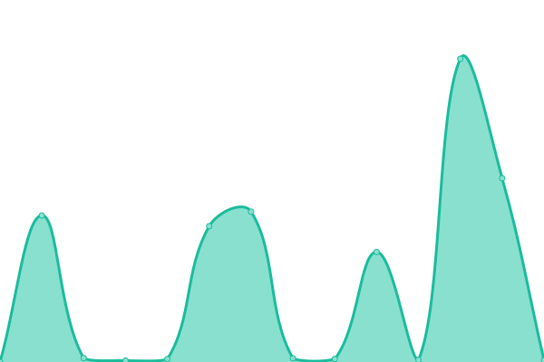
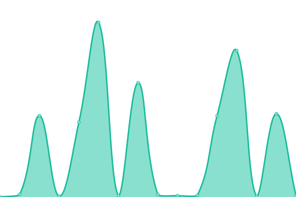

# [📈 Live Status](https://rss.status.ambler.app): <!--live status--> **🟩 All systems operational**

This repository contains the open-source uptime monitor and status page for [Ambler App](https://rss.status.ambler.app), powered by [Upptime](https://github.com/upptime/upptime).

With [Upptime](https://upptime.js.org), you can get your own unlimited and free uptime monitor and status page, powered entirely by a GitHub repository. We use [Issues](https://github.com/amblerapp/status-rss/issues) as incident reports, [Actions](https://github.com/amblerapp/status-rss/actions) as uptime monitors, and [Pages](https://rss.status.ambler.app) for the status page.

<!--start: status pages-->
<!-- This summary is generated by Upptime (https://github.com/upptime/upptime) -->
<!-- Do not edit this manually, your changes will be overwritten -->
<!-- prettier-ignore -->
| URL | Status | History | Response Time | Uptime |
| --- | ------ | ------- | ------------- | ------ |
|  [RSSBox](https://rssbox.ambler.app/) | 🟩 Up | [rss-box.yml](https://github.com/amblerapp/status-rss/commits/HEAD/history/rss-box.yml) | 

 438ms
     
 | 

<a href="https://rss.status.ambler.app/history/rss-box">100.00%</a>
    

|  RSSBox (Render) | 🟩 Up | [rss-box-render.yml](https://github.com/amblerapp/status-rss/commits/HEAD/history/rss-box-render.yml) | 

 364ms
     
 | 

<a href="https://rss.status.ambler.app/history/rss-box-render">100.00%</a>
    

|  [RSSHub](https://rsshub.ambler.app/) | 🟩 Up | [rss-hub.yml](https://github.com/amblerapp/status-rss/commits/HEAD/history/rss-hub.yml) | 

 440ms
     
 | 

<a href="https://rss.status.ambler.app/history/rss-hub">100.00%</a>
    

|  RSSHub (Render) | 🟩 Up | [rss-hub-render.yml](https://github.com/amblerapp/status-rss/commits/HEAD/history/rss-hub-render.yml) | 

 341ms
     
 | 

<a href="https://rss.status.ambler.app/history/rss-hub-render">100.00%</a>
    

|  [RSS-Bridge](https://rssbridge.ambler.app/) | 🟩 Up | [rss-bridge.yml](https://github.com/amblerapp/status-rss/commits/HEAD/history/rss-bridge.yml) | 

 1695ms
     
 | 

<a href="https://rss.status.ambler.app/history/rss-bridge">100.00%</a>
    

|  RSS-Bridge (Render) | 🟩 Up | [rss-bridge-render.yml](https://github.com/amblerapp/status-rss/commits/HEAD/history/rss-bridge-render.yml) | 

 365ms
     
 | 

<a href="https://rss.status.ambler.app/history/rss-bridge-render">100.00%</a>
    

|  [Reddit-RSS](https://reddit-rss.ambler.app/) | 🟩 Up | [reddit-rss.yml](https://github.com/amblerapp/status-rss/commits/HEAD/history/reddit-rss.yml) | 

 1006ms
     
 | 

<a href="https://rss.status.ambler.app/history/reddit-rss">100.00%</a>
    

|  Reddit-RSS (Render) | 🟩 Up | [reddit-rss-render.yml](https://github.com/amblerapp/status-rss/commits/HEAD/history/reddit-rss-render.yml) | 

 907ms
     
 | 

<a href="https://rss.status.ambler.app/history/reddit-rss-render">100.00%</a>
    

<!--end: status pages-->

[**Visit our status website →**](https://rss.status.ambler.app)

## 📄 License

- Powered by: [Upptime](https://github.com/upptime/upptime)
- Code: [MIT](./LICENSE) © [Ambler App](https://rss.status.ambler.app)
- Data in the `./history` directory: [Open Database License](https://opendatacommons.org/licenses/odbl/1-0/)
